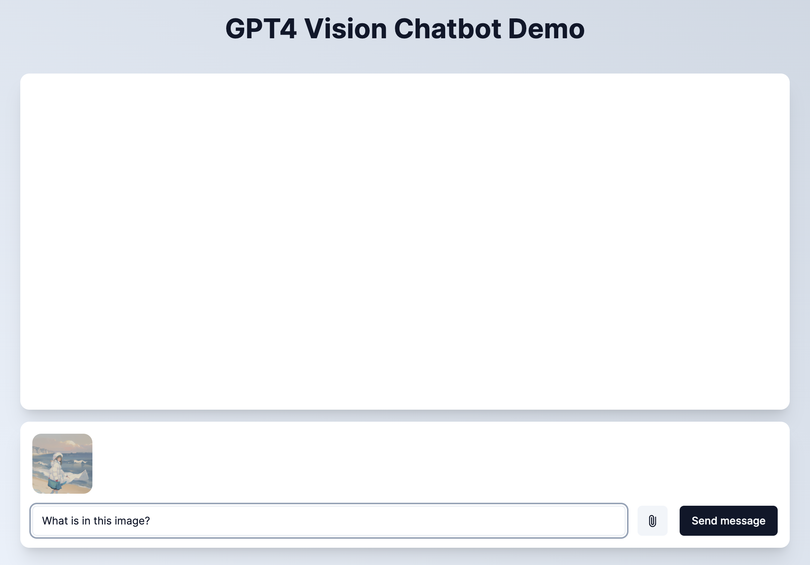

<h1 align="center">GPT4 Vision Chatbot</h1>

<p align="center">
  An open-source AI chatbot app template for GPT4 Vision built with Next.js, the Vercel AI SDK, OpenAI, and <a href="https://github.com/marcusschiesser/ui">marcusschiesser/ui</a>.
</p>

<p align="center">
  <a href="#features"><strong>Features</strong></a> ·
  <a href="#model-providers"><strong>Model Providers</strong></a> ·
  <a href="#deploy-your-own"><strong>Deploy Your Own</strong></a> ·
  <a href="#running-locally"><strong>Running locally</strong></a> ·
</p>
<br/>


## Features

- [Next.js](https://nextjs.org) App Router
- React Server Components (RSCs), Suspense, and Server Actions
- [Vercel AI SDK](https://sdk.vercel.ai/docs) for streaming chat UI
- Support for OpenAI (default), Anthropic, Cohere, Hugging Face, or custom AI chat models and/or LangChain
- [marcusschiesser/ui](https://github.com/marcusschiesser/ui) for chat UI
  - based on [shadcn/ui](https://ui.shadcn.com)
  - Styling with [Tailwind CSS](https://tailwindcss.com)
  - [Radix UI](https://radix-ui.com) for headless component primitives
  - Icons from [Phosphor Icons](https://phosphoricons.com)

## Model Providers

This template ships with OpenAI `gpt-4-vision-preview` as the default. Once [Vercel AI SDK](https://sdk.vercel.ai/docs) supports other vision models, it's easy to update this template.

## Deploy Your Own

You can deploy your own version of the Next.js AI Chatbot to Vercel with one click:

[](https://vercel.com/new/clone?repository-url=https%3A%2F%2Fgithub.com%2Fmarcusschiesser%2Fai-chatbot&env=OPENAI_API_KEY)

## Running locally

You will need to use the environment variables [defined in `.env.example`](.env.example) to run this AI Chatbot. It's recommended you use [Vercel Environment Variables](https://vercel.com/docs/projects/environment-variables) for this, but a `.env` file is all that is necessary.

> Note: You should not commit your `.env` file or it will expose secrets that will allow others to control access to your various OpenAI and authentication provider accounts.

```bash
pnpm install
pnpm dev
```

Your app template should now be running on [localhost:3000](http://localhost:3000/).
